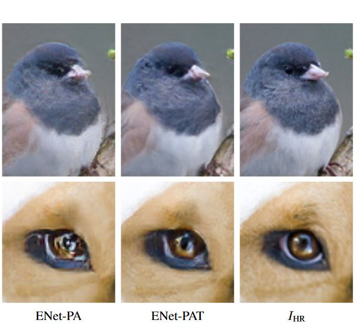

# EnhanceNet-PyTorch
A PyTorch implementation of ENET-PA for Single Image Super Resolution (SISR).

Example from ENET paper

# Description 

ENET-PA here is implemented in PyTorch as there is no current implementation in PyTorch.  All credit goes to Sajjad et al. Adversarial learning along with perceptual loss (hence P+A).  The model is in the form of a GAN and does 4x upscaling of 64x64 images to 512x512.  

#### https://arxiv.org/abs/1612.07919/
